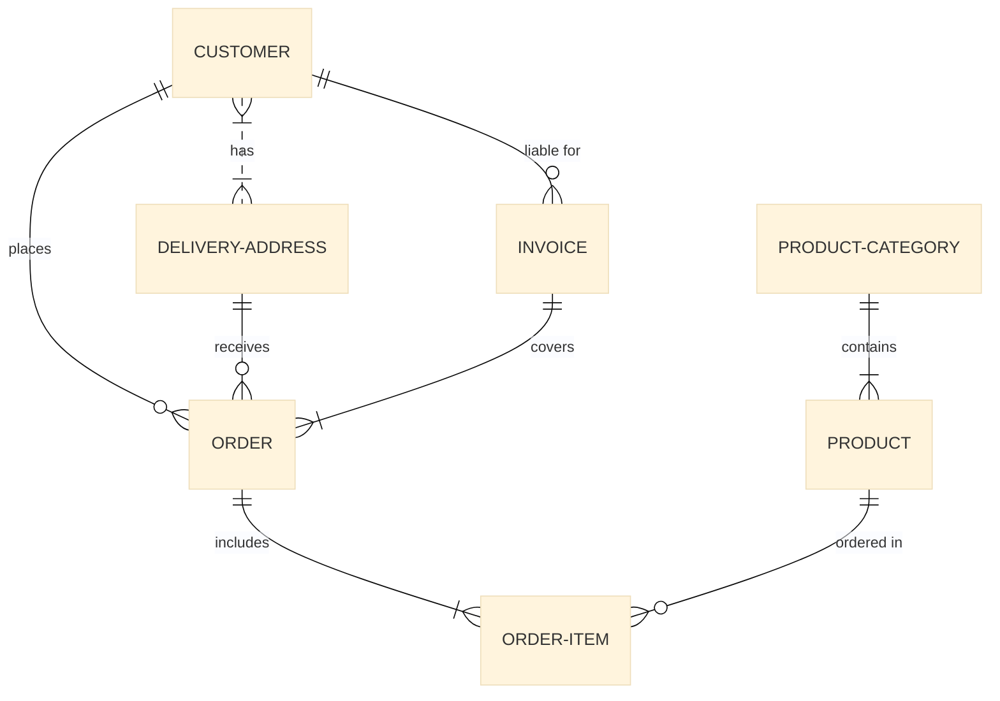
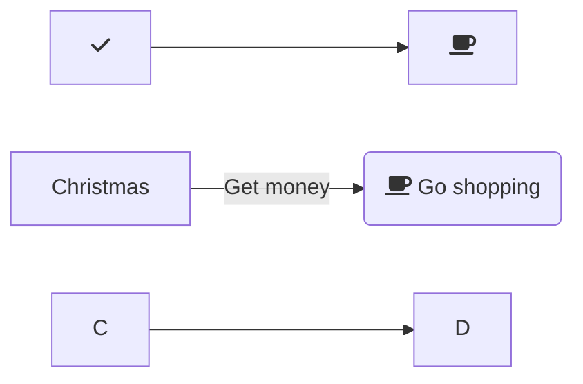
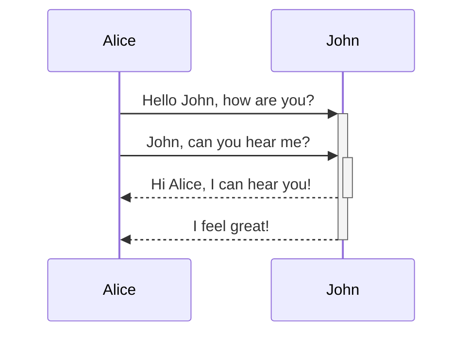

```mermaid
%%{init: {'securityLevel': 'loose', 'theme':'base'}}%%
erDiagram
          CUSTOMER }|..|{ DELIVERY-ADDRESS : has
          CUSTOMER ||--o{ ORDER : places
          CUSTOMER ||--o{ INVOICE : "liable for"
          DELIVERY-ADDRESS ||--o{ ORDER : receives
          INVOICE ||--|{ ORDER : covers
          ORDER ||--|{ ORDER-ITEM : includes
          PRODUCT-CATEGORY ||--|{ PRODUCT : contains
          PRODUCT ||--o{ ORDER-ITEM : "ordered in"

```

```mermaid
%%{init: {'theme':'default'}}%%
graph LR
    fa:fa-check-->fa:fa-coffee
    A[Christmas] -->|Get money| B(fa:fa-coffee Go shopping)
    C --> D
```

```mermaid
%%{init: {'theme':'default'}}%%
sequenceDiagram
    Alice->>+John: Hello John, how are you?
    Alice->>+John: John, can you hear me?
    John-->>-Alice: Hi Alice, I can hear you!
    John-->>-Alice: I feel great!
```

# Header

